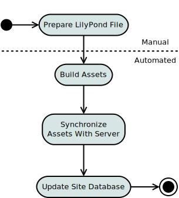
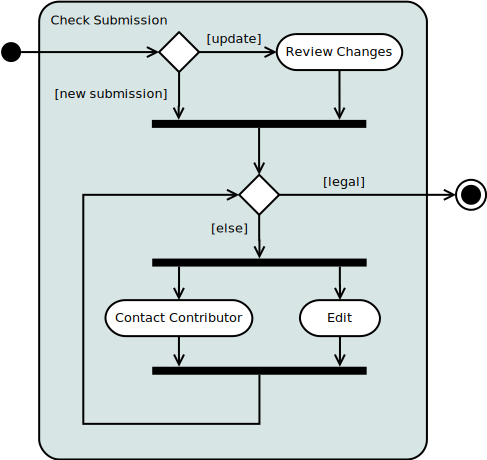
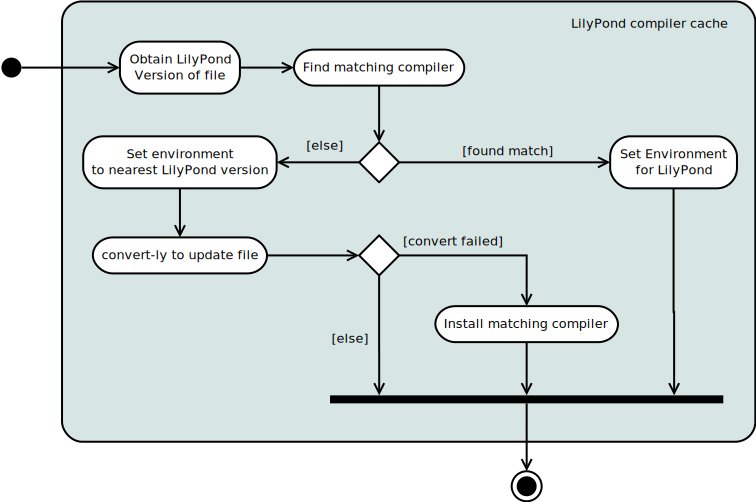

.. mutils design documentation

.. include:: subs.txt

======
Design
======

.. note:: Waiting for a feedback on :doc:`project-plans`. In the
          meantime I've added diagrams that I am still sorting out.

Overview of main tasks
----------------------




Preparing a lilypond file
`````````````````````````
The |mutopia| web site contains sufficient explanation of the
requirements for suitable contributions to the archive. These
submissions may arrive as an email or GitHub pull request. Email
submissions are inserted into the GitHub repository so the activity
diagram starts at that common point,



Some of this could be automated but the result of a review failure at
this point is typically interaction with the user by email so, at this
point, we choose to accept the overhead of this manual step.

Submissions come in 2 flavors, new submissions and updates to existing
pieces. Updates are fairly easy as an assumption can be made that the
copyright and legal issues have already been made. In either case
there are fields in the header that must be updated,

id
    A field whose value is the full `mutopiaID`

footer
    A field whose value contains copyright information for the piece.
    This is a formal |lilypond| tag that defines markup located at the
    bottom of the first page. The footer may make reference to other
    fields of the header (`license`, `id` for the date).

The `mutopiaID` is a unique string that identifies each piece. It has
the following format, ::

  Mutopia-<date>-<id>

  where,
     <date> is a publish date formatted as YYYY/MM/DD, MM and DD are
     zero-filled on the left is less than 10.
     <id> is an integer unique to this piece.

Note that two pieces may be published on the same date but no two
pieces may have the same id. This format allows the pieces to be
sorted with predictable results.

For new submissions the `id` must be generated and in either case the
publish date will need to be changed. This implies that both the `id`
and `footer` need to be refreshed. The flow looks something like,

.. image:: graphics/prep-lilypond-file.svg
   :width: 60 %
   :align: center

On an update, the numberic ID is not changed but the publish date is.
Parsing the header is relatively simple but challenges exist with
regards to locating the appropriate file containing the header.

  - Simple: submissions of a single file where the header is in the
    typical location at the top of the file.

  - Relatively simple: Larger submissions consisting of several instruments,
    often using separate include files to define the individual parts.
    Typically, the header is contained in the main file that includes
    the other parts.

  - Complex: Those submissions where the header is not defined in an
    obvious place, perhaps in a separate include file. This is
    sometimes the case where the author has used a folder hierarchy to
    simplify the creation of a complex piece.


Building assets
---------------
Building assets involves the preparatory step of determining the
appropriate compiler to use for the build.



LilyPond compiler cache
```````````````````````

Attempting automated installations of |lilypond| is probably not worth
the risk. The activity diagram proposes a mechanism that attempts an
automated workaround in the event the version in the file does not
match a compiler in our cache.

The publisher will maintain a cache of the last |lilypond| release of
each major version. That is, the cache wouldn't maintain all the
2.19.* releases, only the most recent (2.19.48 at the time of this
document). The same for the remaining releases,

  - 2.18.2.1
  - 2.17.97-1
  - 2.16.2.1
  - 2.14.2-1
  - 2.10.33-1
  - 2.8.8-1

**Use case:** A file is submitted that specifies |lilypond| 2.19.16.
Since that particular compiler is not in the cache, the environment is
set to the latest 2.19 compiler, 2.19.48. If the build fails, either
piece must be converted or the 2.19.16 compiler must be installed
manually in the cache.


Build order
```````````
The following flow diagram describes a recommended order for the
build,

.. image:: graphics/build-assets.svg
   :width: 60 %
   :align: center

The order of PDF and PostScript file generation is not important,
other than it should be done before the RDF file is generated. The
only requirement for building the preview image is that it is done
prior to building the RDF because the size and width are required. The
changelog is generated after all source files have been committed to
GIT.
