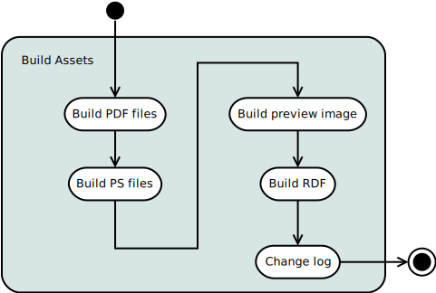

.. mutils design documentation

.. include:: subs.txt

======
Design
======

.. note:: Waiting for a feedback on :doc:`project-plans`. In the
          meantime I've added diagrams that I am still sorting out.

Overview of main tasks
----------------------


Preparing a lilypond file
`````````````````````````
The |mutopia| web site contains sufficient explanation of the
requirements for suitable contributions to the archive. These
submissions may arrive as an email or GitHub pull request. Email
submissions are inserted into the GitHub repository so the activity
diagram starts at that common point,


Some of this could be automated but the result of a review failure at
this point is typically interaction with the user by email so, at this
point, we choose to accept the overhead of this manual step.

Submissions come in 2 flavors, new submissions and updates to existing
pieces. Updates are fairly easy as an assumption can be made that the
copyright and legal issues have already been made. For new files a
unique numeric ID must be generated but in either case the full
mutopia ID, containing the publish date and ID, must be updated or
inserted into the file. This requires an edit that can be automated.

.. image:: graphics/prep-lilypond-file.svg
   :width: 40 %
   :align: center

Issues
``````
  - Assigning the ID needs more detail


Building assets
---------------
Building assets involves the preparatory step of determining the
appropriate compiler to use for the build.

.. image:: graphics/lilypond-cache.svg
   :width: 70 %
   :align: center

LilyPond compiler cache
```````````````````````

Attempting automated installations of |lilypond| is probably not worth
the risk. The activity diagram proposes a mechanism that attempts an
automated workaround in the event the version in the file does not
match a compiler in our cache.

The publisher will maintain a cache of the last |lilypond| release of
each major version. That is, the cache wouldn't maintain
all the 2.19.* releases, only 2.19.46. The same for the remaining
releases,

  - 2.18.2.1
  - 2.17.97-1
  - 2.16.2.1
  - 2.14.2-1
  - 2.10.33-1
  - 2.8.8-1

**Use case:** A file is submitted that specifies |lilypond| 2.19.16.
Since that particular compiler is not in the cache, the environment is
set to the latest 2.19 compiler, 2.19.46. The ``convert-ly`` utility
is run on the submitted file and, if successful the process continues.
On failure, the 2.19.16 compiler needs to be installed.


Build assets
````````````
For the assets, creation of the preview image should precede that of
the RDF. The change log is derived from a ``git`` command is shown
here at the end of the activity diagram but it can be generated at any
time.



