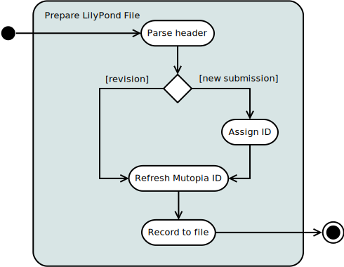
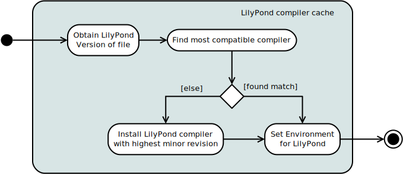

.. mutils design documentation

.. include:: subs.txt

======
Design
======

.. note:: Waiting for a feedback on :doc:`project-plans`. In the
          meantime I've added diagrams that I am still sorting out.

Overview of main tasks
----------------------

.. image:: graphics/big-picture.svg
   :width: 40 %
   :align: center


Preparing a lilypond file
`````````````````````````
The |mutopia| web site contains sufficient explanation of the
requirements for suitable contributions to the archive. These
submissions may arrive as an email or GitHub pull request. Email
submissions are inserted into the GitHub repository so the activity
diagram starts at that common point,

.. image:: graphics/submission-check.svg
   :width: 60 %
   :align: center

Some of this could be automated but the result of a review failure at
this point is typically interaction with the user by email so, at this
point, we choose to accept the overhead of this manual step.

Submissions come in 2 flavors, new submissions and updates to existing
pieces. Updates are fairly easy as an assumption can be made that the
copyright and legal issues have already been made. In either case
there are fields in the header that must be updated,

  id
    A field whose value is the full `mutopiaID`

  footer
    A field whose value contains copyright information for the piece.
    This is a formal |lilypond| tag that defines markup located at the
    bottom of the first page. The footer may make reference to other
    fields of the header (`license`, `id` for the date).

The `mutopiaID` is a unique string that identifies each piece. It has
the following format, ::

  Mutopia-<date>-<id>

  where,
     <date> is a publish date formatted as YYYY/MM/DD, MM and DD are
     zero-filled on the left is less than 10.
     <id> is an integer unique to this piece.

Note that two pieces may be published on the same date but no two
pieces may have the same id. This format allows the pieces to be
sorted with predictable results.

For new submissions the `id` must be generated and in either case the
publish date will need to be changed. This implies that both the `id`
and `footer` need to be refreshed. The flow looks something like,



On an update, the numberic ID is not changed but the publish date is.
Parsing the header is relatively simple but challenges exist with
regards to locating the appropriate file containing the header.

  - Simple: submissions of a single file where the header is in the
    typical location at the top of the file.

  - Relatively simple: Larger submissions consisting of several instruments,
    often using separate include files to define the individual parts.
    Typically, the header is contained in the main file that includes
    the other parts.

  - Complex: Those submissions where the header is not defined in an
    obvious place, perhaps in a separate include file. This is
    sometimes the case where the author has used a folder hierarchy to
    simplify the creation of a complex piece.


.. _auto-pieceid:

Automating ID assignment
------------------------

The easiest way to describe this is to provide a UML sequence diagram
that outlines the steps and then textually walk through the sequence.


The major players are,

  - The `BuildMachine` which is used for any location where a build
    might take place; a home workstation, an AWS AMI, etc.
  - `GitHub`, where are contribution and submissions are staged and
    processed as pull requests.
  - `MuSite`, the web-based site.
  - The `DataServer`, the location where all built assets are stored.

**Processing the pull request** is the start of the sequence processes
which causes a merge of the branch containing the contribution. A
`webhook` is attached to the GitHub repository so that when items are
committed a push notification is sent to our web server (`MuSite`).
The web site responds to this request by updating (or creating) a row
in the ``AssetMap`` database table. This table is used to map the hard
assets on disk storage to pieces described in the database. Whether
the row in the ``AssetMap`` table is created or updated it always sets
its `published` flag to false, indicating that this asset requires a
build.

**A note on AssetMap Design:** It would be helpful here to review the
``AssetMap`` database table and its role in this sequence.


An ``AssetMap`` has a 1:1 relationship to a ``Piece``. It is an
association, not an aggregate relationship, so that an ``AssetMap``
instance can exist without a ``Piece``. This relationship is used to
allow new assets to come into existence by first being entered into
the database as an *unpublished* asset with no associated ``Piece``.
The design emphasizes the notion that either instance can exist
without the other but neither can function fully without the
association. An ``AssetMap`` without a ``Piece`` is typically a newly
contributed piece waiting for the build process to complete, and a
``Piece`` could exist without an ``AssetMap`` but would lack the
ability to locate its physical assets.

**Determining the new ID:** The second full sequence on the
BuildMachine is a basic publish sequence. An *update/status* message
is sent as a URL to ``MuSite`` which responds with a |JSON| data structure
containing all the relevant data for determining an integer value for
the next mutopia ID. The following is an actual structure returned
after a pull request for the piece titled, "in_may_piano" by the
composer with the mutopia-formatted name of "BehrF", ::

  {"LastID": 2154, "pending": ["BehrF/in_may_piano"]}

At the time this piece was pulled into the MutopiaProject archive, the
last assigned identifier had the value of 2154 and the new pending
piece is located in the folder "BehrF/in_may_piano". Armed with this
information we can safely assign the value 2155 to this piece. This
|JSON| data can easily be read by python code, ::

  import requests

  SITE='http://musite-dev.us-west-2.elasticbeanstalk.com/'

  request = requests.get(SITE+'update/status/')
  status_data = request.json()

  for val in ['LastID', 'pending',]:
      print('{0} = {1}'.format(val,status_data[val]))

The results for this are, ::

  LastID = 2154
  pending = ['BehrF/in_may_piano']

**Continuing with the sequence diagram,** a full build for the pending
piece is done on the build machine. Part of this process updates the
Mutopia header with the new id and may also include other edits
required along the way. These are committed to the master on the
``BuildMachine`` and then pushed to ``GitHub``. [#f1]_ For simplicity this
step is not shown here. Once the build is complete the assets are
synchronized with the ``DataServer`` in a folder hierarchy that
matches the build machine.

**The final step** is a request to update the database of the website.
This management command will walk through each row in the ``AssetMap``
table that is marked unpublished, read their associated RDF file, and
update the database with that information. Once this is done, new
files that didn't previously have a row in the ``Piece`` table are now
visible on the website.


Building assets
---------------

The mechanism of building publication assets specified in the
requirements (see :ref:`req-pub`) are described here. To solve the
problem of submissions using various |lilypond| version, a compiler
caching method is described. The initial step is preparatory and
outlines how to determine the appropriate compiler to use for the
build.




LilyPond compiler cache
```````````````````````
Music submitted for publication may require a variety of |lilypond|
compilers --- users may be using default versions for their operating
systems, experimenting with advanced releases, or may not be
comfortable with upgrading from older releases. The goal of the
compiler cache is to maintain a library of releases that we can use
against the majority of submissions.

This is done in a relatively simple manner. A set of folders (the
"compiler cache") will be maintained by the software that will be
named according to the version string required in the submission.
During a build the version of the input file is identified and the
appropriate compiler is determined. If the compiler is not in the
cache, it is retrieved from the |lilypond| compiler download area.
This scheme infers these requirements,

  - The LilyPond download site must have compilers that support the
    operating system of the ``mupub`` build machine.

  - ``mupub`` must identify its operating system and be able to match
    it to the available compiler on the download site.

  - It may be necessary to upgrade a LilyPond in the event a matching
    compiler is not available. (This feature is not a requirement in
    the initial release.)


Build order
```````````
The following flow diagram describes a recommended order for building
assets,

.. image:: graphics/build-assets.svg
   :width: 60 %
   :align: center

The order of PDF and PostScript file generation is not important,
other than it should be done before the RDF file is generated. The
only requirement for building the preview image is that it is done
prior to building the RDF because the size and width are required. The
changelog is generated after all source files have been committed to
GIT.


.. rubric:: Footnotes

.. [#f1] This GitHub push will cause webhooks to run but it will
         result in a no-op since this piece is already marked as
         unpublished. There is really no way to know *a priori* what
         is in a push so the resulting activity is carefully written
         to recognize when an update is not needed.
