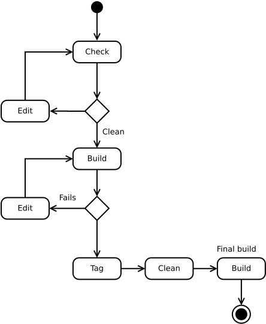

.. users guide for mupub application script

.. include:: subs.txt

==================
MUPUB User's Guide
==================

Overview
--------

The **mupub** application is implemented as a python support library containing a command line
script. The various commands provided by this script are described here.

.. note:: This is a preliminary document as many required features have not yet been implemented.
          One important feature, :ref:`auto-pieceid`, is not implemented at this time.

Installation
------------

This application is still in development and is distributed using a
|wheel| file to make installation a little easier. To install from a
wheel distribution locally.

.. code-block:: bash

  $ python3 -m pip install mupub-0.2.4-py2.py3-none-any.whl --user

The application requires python3. The ``--user`` switch in the above command will direct pip to
install the application and library without requiring permissions. Installing in this fashion will
install all the required packages. If all the required packages are installed on the target machine,
installations can be accomplished from a simple distribution package,

.. code-block:: bash

   $ python3 -m setup install mupub-0.2.4.tar.gz --user

Command Reference
-----------------

The mupub application is a cohesive collection of commands in a single application that mirror the
functionality provided by existing scripts and java code. It incorporates a common style of
interface so that commands can be modified or added.

  - :ref:`init-command`
  - :ref:`check-command`
  - :ref:`build-command`
  - :ref:`tag-command`
  - :ref:`clean-command`

.. _init-command:

Initialize Command
~~~~~~~~~~~~~~~~~~

Running ``mupub init`` will initialize a configuration file and a small local database.

  - The configuration file is written using the internal python :py:mod:`configparser`. It can be
    edited after initializing.

  - The database is created and populated using a command that requests information from the
    MutopiaProject web site datafiles.

  - The default logging is a rotating file configuration.

  - The latest published piece-id is retrieved from |mutopia|.

If you have an existing configuration, the ``init`` command will present the existing values to give
you the option of updating them. The configuration is then written back out so that choices that you
may have made manually, like logging, are not lost.

Configuration file
..................

A bare-bones configuration file is created when ``init`` on its first run. It can always be
recreated by deleting the existing configuration file and re-running ``init``. ::

    [common]
      site_url = http://musite-dev.us-west-2.elasticbeanstalk.com/
      local_db = mu-min-db.db
      download_url = http://download.linuxaudio.org/lilypond/binaries/
    [logging]
      loglevel = WARN
      log_to_file = True
      logfilename = mupub-errors.log

The ``loglevel`` is the desired level for console logging, file
logging is always at the ``INFO`` level. See
:py:meth:`~logging.Logger.setLevel` for a list of supported levels.

.. _check-command:

Check Command
~~~~~~~~~~~~~

This command verifies that a contribution has a valid header. During a build the `publisher` changes
their directory to the target piece within the MutopiaProject folder hierarchy (see
:doc:`archive-naming`) to execute **mupub** commands. Typically, you would run this command to
verify the contribution is ready to build.

  - Resolve the |LilyPond| source file.
  - Read the header elements.
  - Check that all required header elements are valid.
  - Install the appropriate |lilypond| compiler if necessary.

The goal of the check command is to insure a :ref:`build-command` will succeed.

.. _tag-command:

Tag Command
~~~~~~~~~~~

This command updates the MutopiaProject elements in the header file to
reflect the current copyright graphics and publication date. If it is
a new submission, the integer identifier is passed so that the footer
is updated with the publication date.

.. _build-command:

Build Command
~~~~~~~~~~~~~

Once the submission has been :ref:`checked <check-command>`, a build
can be done to generate all the assets necessary for publication (see
:ref:`req-pub` for requirements). The command structure is similar to
the :ref:`check-command`,

A build is sensitive to the complexity of the submission. On large
submissions it may be necessary to *collect* several part files and
provide them as a compressed or zip'ed file.

.. note:: On extremely complex submissions, it may be necessary to manually build additional files
          and then use the ``--collect-only`` option to gather files into compressed collections.

Use the :ref:`tag-command` before doing a final build for publication.

.. _clean-command:

Clean Command
~~~~~~~~~~~~~

It is likely that you will encounter issues during the build and you
may need to iterate the build process. Doing a build-edit-build cycle
is typically not a problem but for an official build it is a good idea
to start with a clean slate. This command will erase any build files
that you have previously created. The command allows a ``dry-run`` to
list the commands it will run without executing them.

.. _usage:

Usage
-----

The typical workflow is to check, edit, build, and review until satisfied with the output. Then the
piece is tagged, build artifacts are cleaned from the folder, and the final build is done.

   Publishing build workflow

All ``mupub`` commands must be run from the folder in which the final build assets will be
published. These commands can take a |lilypond| filename as an option but in most scenarios it is
not necessary. On complicated builds that may have header information somewhere other than the main
source file you might have to help ``mupub`` by specifying the ``--header-file`` flag. Whatever flag is
passed to ``check`` should be passed to ``build`` and ``tag``.

``mupub tag`` parses the header to find existing piece identifiers, if any. Contributors will
sometimes create a temporary tag for the purpose of reviewing the submission as it would look with
the copyright at the bottom of the file. Any illegal tag (e.g., -0 or -draft) will be considered a
new submission and the user will be prompted with a guess for the new piece id. Legal tags are
parsed and the user is prompted with the existing identifier.

Initializing
~~~~~~~~~~~~

The user should run the ``init`` command whenever,

  - configuration values need to be changed.
  - new pieces have been published to the web site.
  - an updated ``mupub`` application has been installed.
  - any of the datafiles have been edited

It is always safe to run the ``init`` command so run it if your are not sure.

There are two functions to the initialization process: updating the configuration values
and synchronizing data from various data sources. The application tracks these details in a small
local database. The decision to do things this way is because there is no central database holding
all of the information needed to be tracked for publication. Once configuration is set and there is
no need for modifying the configuration, the configuration queries can be skipped by only doing the
synchronization step using the ``--sync-only`` flag,

.. code-block:: bash

  glenl@lola$ mupub init --sync-only
  INFO     mupub.commands.init starting initialization
  INFO     mupub.commands.init Looking at http://www.mutopiaproject.org/
  INFO     mupub.commands.init 2207 is pending
  INFO     mupub.commands.init 2208 is pending
  glenl@lola$

.. note:: To get the above output I edited the configuration manually and set loglevel to INFO.

The output shows that two pieces, 2207 and 2208, are still awaiting publication (assigned but not
yet processed.) Verifying with the website shows that 2206 is the most recently published piece.

What is in the configuration folder
~~~~~~~~~~~~~~~~~~~~~~~~~~~~~~~~~~~

The configuration area for the ``mupub`` application is ``$HOME/.mupub``. After initialization you
will find these elements in this folder,

.. table:: Configuration Area
   :widths: auto

   ================  ===============================================================
         Name          Purpose
   ================  ===============================================================
   lycache           A folder containing |lilypond| installations done by ``check``
   mu-config.cfg     The configuration file
   mu-config.cfg~    A backup of the configuration file
   mu-min-db.db      The SQLite database
   mupub-errors.log  The log file
   ================  ===============================================================

.. warning:: The *lycache* area may get heavily populated over time when there are many submissions
             using different compilers. This typically slows over time but it is safe to remove
             installations that you know are no longer or rarely used.

Listing zipped source files
~~~~~~~~~~~~~~~~~~~~~~~~~~~

How does one check the contents of zipped build assets? Like this,

.. code-block:: text

  glenl@lola:Concerto_No3$ unzip -l Concerto_No3-lys.zip
  Archive:  Concerto_No3-lys.zip
    Length      Date    Time    Name
  ---------  ---------- -----   ----
      15502  2017-01-02 13:06   Concerto_No3-lys/pianotwo.ly
       7664  2017-01-02 13:06   Concerto_No3-lys/clarinetti.ly
       8863  2017-01-02 13:06   Concerto_No3-lys/oboi.ly
       9788  2017-01-02 13:06   Concerto_No3-lys/violinotwo.ly
       8487  2017-01-02 13:06   Concerto_No3-lys/flauti.ly
       9942  2017-01-02 13:06   Concerto_No3-lys/violinoone.ly
       5966  2017-01-02 13:06   Concerto_No3-lys/cornies.ly
       2683  2017-01-02 13:06   Concerto_No3-lys/Concerto_No3.ly
       7094  2017-01-02 13:06   Concerto_No3-lys/bassi.ly
       9671  2017-01-02 13:06   Concerto_No3-lys/fagotti.ly
       2610  2017-01-02 13:06   Concerto_No3-lys/timpani.ly
       7692  2017-01-02 13:06   Concerto_No3-lys/viola.ly
      18924  2017-01-02 13:06   Concerto_No3-lys/pianoone.ly
       3710  2017-01-02 13:06   Concerto_No3-lys/trombe.ly
  ---------                     -------
     118596                     14 files
  glenl@lola:Concerto_No3$

Help
~~~~

In addition to basic usage help, there is additional help provided at the command line. For example,

.. code-block:: text

  glenl@lola$ mupub --help         # for help on the application
  usage: mupub [-h] [--version] [--verbose] {clean,build,tag,check,init}

  This is a command-line utility for managing the publication of
  Mutopia Project contributions. All unctionality is provided by
  commands within this utility:

      check - Reviews the contributed piece for validity.
      tag   - Modifies the header with MutopiaProject fields.
      build - Builds a complete set of output files for publication.
      clean - Clears all build products.

  positional arguments:
    {clean,build,tag,check,init}

  optional arguments:
    -h, --help            show this help message and exit
    --version             show program's version number and exit
    --verbose             louder

  Use mupub <command> --help for specific command help
